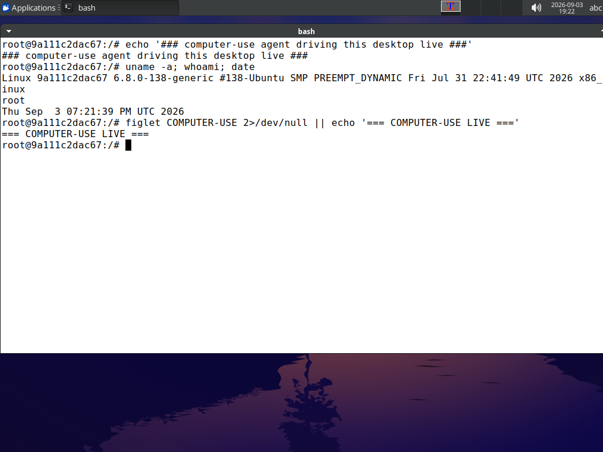
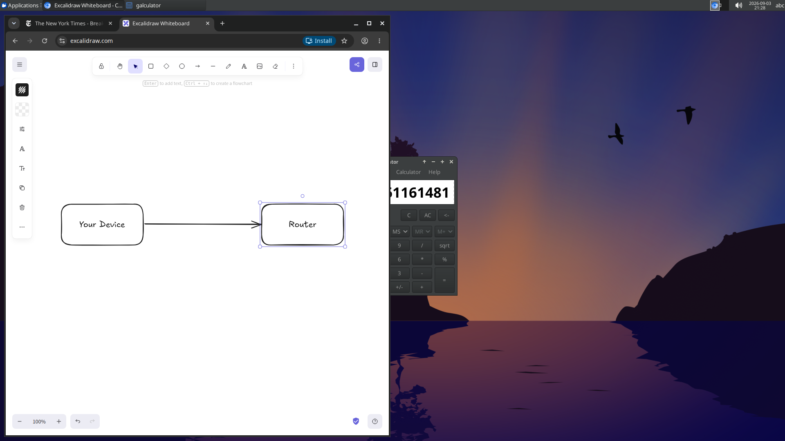

# computer-use-atspi

A Linux desktop computer-use agent that grounds its clicks in the **accessibility
tree (AT-SPI2)** instead of guessing pixel coordinates from a screenshot.

It runs a model in a containerised Linux desktop, lets it open apps, click, type,
run shell commands and draw, and shows the whole thing live in a web UI (streamed
reasoning, every tool call, a view-only VNC of the desktop).

This is a research demo built to prove one point: on Linux, **reading the OS
accessibility tree beats screenshot + pixel guessing** for GUI grounding. It is
not meant as the production path — see "Where this fits" below.



## The point it proves

Every popular computer-use agent grounds clicks the same way: send a screenshot,
have the model estimate `(x, y)`, click there. OpenAI's CUA, Anthropic's
computer-use demo, and both of the well-known `computer-use-mcp` servers all do
this. It is universal but imprecise and token-hungry — the model literally guesses
where a button is.

We saw it fail live: asked to compute `47 × 89` on a calculator, the model clicked
`(909, 600)` for the "7". The real "7" is at `(862, 601)`. `(909, 601)` is the
"8". So it typed 48 instead of 47.

On Linux there is a better source of truth. Every GTK/Qt/GNOME app exposes its
widget tree over **AT-SPI2** (the accessibility bus that screen readers use).
`atspi_dump.py` walks that tree and prints, for each interactive element, its role,
name, and **exact centre coordinate** — plus the live value of text fields and
displays:

```
[33] toggle button "7" @(862,601)
[32] toggle button "8" @(911,601)
[6]  text "83810205" @(976,470)
```

The model reads that as cheap text, clicks the exact coordinate, and reads results
straight from the tree. No guessing, no screenshot needed for structured UIs.

### What the popular MCPs actually do on Linux

We researched the two `computer-use-mcp` projects people point to:

- **domdomegg/computer-use-mcp** — screenshot + pixel only. One `computer` tool
  (Anthropic clone). Adds a cursor crosshair for error feedback. No accessibility.
- **zavora-ai/computer-use-mcp** — has the right accessibility-first *architecture*,
  but its **Linux AT-SPI backend is an unimplemented stub** (`perform_action`
  returns "AT-SPI2 accessibility not yet implemented on Linux"). On Linux it
  degrades to screenshots + pixels.

So on Linux, this repo's working AT-SPI grounding is ahead of both. The one real
precedent for AT-SPI grounding on Linux is the OSWorld benchmark, which uses the
same `pyatspi`/AT-SPI approach.

## How it works

A plain Python loop, one action per step:

```
screenshot / ui_tree  ->  model (GLM via Deep Infra, OpenAI-compatible, streamed)
      ^                         |
      |                    one tool call
   new state  <--  execute in the VM (xdotool / bash / AT-SPI)
```

- **`computer.py`** — executes actions inside the desktop container over
  `docker exec`: `xdotool` for mouse/keyboard, `xwd`→PNG for screenshots, and
  `atspi_dump.py` for the accessibility tree.
- **`atspi_dump.py`** — runs inside the container, uses `gi.repository.Atspi` to
  serialise the interactive widget tree with roles, names, values and coordinates.
- **`agent_loop.py`** — the tool schema (official OpenAI function-calling, one
  function per action: `click`, `drag`, `type_text`, `press_key`, `launch`,
  `bash`, `get_ui_tree`, `message`, `done`, …), the system prompt, and a CLI loop.
- **`client.py`** — OpenAI-compatible chat, streaming, with GLM reasoning enabled.
- **`webui.py`** — a controllable session with a web UI: you type the prompts,
  watch the reasoning stream live, see every tool call and the final answer, and
  pause / stop / clear. The desktop is embedded as a view-only VNC.

### The grounding router (the thesis)

Structured UIs should never be pixel-guessed. Route per app, in this order:

1. **App API / script** — a browser via CDP/Playwright, files via the shell,
   Blender via its Python API. Zero grounding error. Best.
2. **Accessibility tree (AT-SPI)** — native GTK/Qt/GNOME apps, and Chromium with
   `--force-renderer-accessibility`. Exact, cheap, scroll/zoom-invariant.
3. **Screenshot + pixel (+ Set-of-Marks)** — the last resort, only for canvas /
   games / GPU apps that expose no tree (Blender's own UI, drawing surfaces).

Pixel grounding is the fallback, not the default.

## Demos

Real runs, all driven by GLM-5.3-Flash:

- **Calculator** — clicks `4 7 × 8 9 =` on exact AT-SPI coordinates (fixing the
  pixel-guess that hit "8" instead of "7") and reads the display value straight
  from the accessibility tree — see the tree snippet above.
- **Excalidraw** — the canvas case, and a deliberate failure demo. With no useful
  a11y tree, the agent falls back to keyboard shortcuts (`r`, `a`, `t`) plus the
  `drag` tool and slowly draws boxes by hand. It managed two labelled boxes and a
  connector before drifting off — and this is the *wrong* approach regardless:
  Excalidraw has a scene JSON you would simply import. It is here to show the
  inefficient path, not to praise it.
  
- **Browser** — opens Chromium, navigates to a site, dismisses the cookie dialog,
  reads the headlines.
- **Coding** — writes a Python script via `bash`, runs it, notices its own wrong
  output, debugs it with `cat -A`/`md5sum`, and fixes it. Self-correcting.

## Run it

You need Docker and a linuxserver.io Webtop-style desktop container (XFCE, with
`xdotool`, `at-spi2-core`, `python3-gi`) named `cu-live`, exposing a view-only VNC
on `:3002`. Then:

```bash
pip install requests
cp .env.example .env      # put your Deep Infra API key in it
python webui.py           # open http://localhost:8090
```

The model is swappable via `.env` (`CU_BASE_URL` / `CU_MODEL` / `CU_API_KEY`); the
default is `zai-org/GLM-5.3-Flash` on Deep Infra. See `ARCHITECTURE.md` for the
context-management and image-cap design.

## Where this fits

This proves the accessibility-first idea. In production you would not GUI-navigate
a browser at all — you would drive it via Playwright/CDP and reserve the AT-SPI /
screenshot layer for native desktop apps. Pixel/screenshot GUI navigation is the
narrow fallback for apps that expose nothing else.

## Conclusion: computer-use is a fallback, not a default

The honest takeaway from building this: pixel/GUI computer-use is almost never the
right tool, on any OS. Roughly 99% of real tasks are done better by:

- the **command line** (files, builds, data, system) — one `bash` call, no pixels,
- **app APIs / MCP servers** (GitHub, Stripe, databases, Blender's Python API,
  Excalidraw's scene JSON) — structured and exact,
- **the browser via Playwright/CDP** — DOM refs, not screenshots.

This is not a Linux limitation. macOS (AX API) and Windows (UI Automation) expose
the same kind of accessibility tree, and the same holds there: reading structure
beats guessing pixels, and doing the task through a shell or API beats touching the
screen at all. "Look at the screen and click" is inefficient on every platform;
training a model harder on screenshots does not change that economics.

Give a model a shell plus the right MCPs and it handles nearly everything without a
screen to look at. Computer-use only earns its place for the narrow set of GUI-only
apps that expose no API and no scripting. Even then, use the accessibility tree
(this repo's point) when one exists, and fall back to pixel-guessing only when it
does not. Build the router, use the cheap exact paths first, and treat clicking
pixels as the last resort it is.

## References

- OSWorld (AT-SPI/pyatspi grounding on Ubuntu): https://arxiv.org/abs/2404.07972
- Set-of-Mark prompting: https://arxiv.org/abs/2310.11441
- domdomegg/computer-use-mcp, zavora-ai/computer-use-mcp
- Anthropic computer-use-demo (coordinate scaling, `only_n_most_recent_images`)
- Microsoft Playwright MCP (accessibility snapshot + refs)
